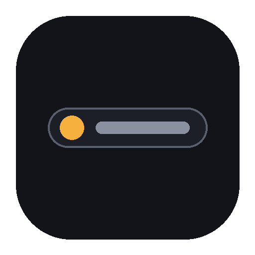

<p align="center">
  
</p>

<h1 align="center">Pill</h1>

<p align="center">
  <em>A menu bar companion for <a href="https://docs.claude.com/en/docs/claude-code">Claude Code</a></em>
</p>

<p align="center">
  
  
  
</p>

<p align="center">
  <a href="#install"><b>Install</b></a> ·
  <a href="#features"><b>Features</b></a> ·
  <a href="#things-to-know"><b>Things to know</b></a> ·
  <a href="CONTRIBUTING.md"><b>Contributing</b></a>
</p>

---

Claude Code sometimes needs to ask you something — can it run this command,
can it edit this file — and if you've tabbed away, that question is easy to
miss. Pill sits in your menu bar/system tray and puts that question right in
front of you, wherever you are: a notification, a pulsing icon, and (on
macOS) Allow/Deny buttons right on the notification itself, no matter which
Space or full-screen app you're currently in.

*Unofficial and not affiliated with or endorsed by Anthropic.*

## What it looks like

```
                                    🔵 status
  ┌──────────────────────────────────────┐
  │ Bash · rm -rf node_modules && npm i  │   ← what Claude wants to run
  │ Allow                                │
  │ Deny                                 │
  │ Answer in Terminal                   │
  │ ─────────────────────────────────────│
  │ other-repo — working    [auto]       │   ← click = open in VS Code
  └──────────────────────────────────────┘
```

## Features

- **Never miss a permission prompt** — a native notification follows you
  across Spaces and full-screen apps, re-announcing every ~12s until you
  answer. On macOS it has real Allow/Deny buttons and sound right on the
  banner; on Windows it's currently a plain toast (no buttons yet — see
  [Things to know](#things-to-know)).
- **Answer without touching the terminal** — Allow, Deny, or click through to
  the tray menu for more context, all from the menu bar/tray.
- **Only interrupts when it actually needs to.** If Claude Code would've
  silently allowed the call anyway — an existing permission rule, auto-accept
  mode, or you're already looking at the right editor/terminal window — Pill
  gets out of the way and lets the normal flow happen.
- **See all your sessions at a glance** — repo, status (working/idle/waiting),
  and current permission mode, right in the menu.
- **One click to jump to the right VS Code window** — reuses an already-open
  window instead of spawning a duplicate.
- **Launch at login**, a real native tray icon and menu on each platform —
  no custom window fighting with Spaces, transparency, or DPI scaling.

## Install

### macOS

**1. Download the latest release** (a `.dmg`) from the Releases page, open
it, and drag **Pill.app** into **Applications**. It isn't notarized with a
paid Apple Developer ID yet, so macOS will refuse to open it with **"Pill"
is damaged and can't be opened** — that's Gatekeeper being unable to verify
an unsigned, browser-downloaded app, not an actual problem with the file.
Clear the quarantine flag once and it'll open normally from then on:
```bash
xattr -cr /Applications/Pill.app
```

**2. Launch it once**, then run this one command in Terminal to wire up the
Claude Code hooks — it's bundled inside the app, so there's nothing else to
download or clone:
```bash
python3 "/Applications/Pill.app/Contents/Resources/hooks/install.py"
```
This copies the hook scripts to `~/.claude/hooks` and registers them in
`~/.claude/settings.json` (backing it up first, and leaving any hooks you
already have for other tools untouched). Safe to re-run any time.

**3. Restart your Claude Code sessions** so they pick up the new hooks.
That's it — Pill is now in your menu bar.

Turn on "Launch at Login" from the tray menu whenever you're ready for it to
start automatically.

### Windows

Windows support is new and not yet on the Releases page — grab the latest
build from the repo's **Actions** tab: open the most recent successful
**Build** run and download the **pill-windows-latest** artifact.

**1. Run the installer** (`.msi` or the NSIS `.exe`, either works). It's
unsigned, so **Windows SmartScreen will say "Windows protected your PC"** —
the same unsigned-binary situation as the macOS Gatekeeper warning above, not
a problem with the file. Click **More info → Run anyway**.

**2. Launch Pill once**, then run this in a terminal to wire up the Claude
Code hooks (adjust the path if you installed elsewhere — check the Pill
shortcut's target if you're not sure):
```powershell
python "C:\Program Files\Pill\resources\hooks\install.py"
```

**3. Restart your Claude Code sessions.** Pill will be in the system tray —
Windows hides new tray icons under the **`^` overflow chevron** the first
time; click that to find it, then drag it out if you want it always visible.

Real Allow/Deny buttons on the notification itself aren't implemented yet on
Windows (see [Things to know](#things-to-know)) — approvals still go through
the tray menu.

## Things to know

- **Timeouts are layered on purpose:** Pill waits up to 280s for you to
  respond. If you don't, it falls through to Claude Code's normal terminal
  prompt — Pill can never lock you out of a session.
- Plan-mode questions and multi-choice prompts still need the terminal for
  now — Pill flags the session as needing attention, but click through to
  answer there.
- macOS tucks notification action buttons behind an Options/hover reveal by
  default — that's a system presentation choice, not something Pill controls.
- **Windows notifications are a plain toast for now** — no Allow/Deny buttons
  on it yet, just title/body. Clicking the toast opens the tray menu, where
  you can still answer. Real buttons are on the roadmap; the underlying
  library already supports them.
- Windows support hasn't run through the same real-world mileage as macOS
  yet — file an issue if something looks off.

## Contributing

Bug reports and PRs welcome — see [CONTRIBUTING.md](CONTRIBUTING.md) for
how the project is put together, how to run it locally, and a few
hard-won gotchas worth knowing before you dig in.

## Roadmap ideas

- "Allow & remember" — write the matched pattern straight into
  `permissions.allow` from the menu, so repeated approvals taper off
- Real Allow/Deny buttons on the Windows toast, matching macOS — the
  notification library already supports it, just not wired up yet
- Linux builds — the Rust/hook core isn't tied to a window and is already
  most of the way there
- Claude Code running inside WSL, with Pill as a native Windows tray app —
  not attempted yet, needs cross-boundary path translation
